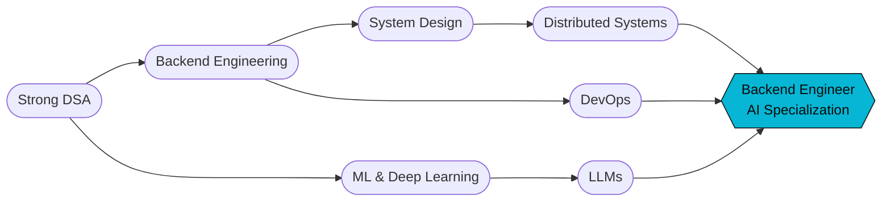
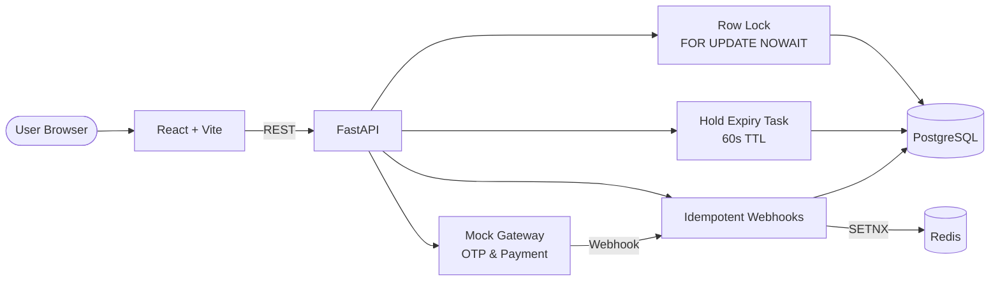

<div align="center">


<a href="https://github.com/TanimStu068">
  
</a>

<br><br>

[](https://linkedin.com/in/tanim-mahmud68)
[](https://leetcode.com/u/dark_321)
[](mailto:tmahmud547@gmail.com)
[](https://v0-portpolio-dqt6.vercel.app/)
[](https://github.com/TanimStu068)


<br>


</div>

---

## 🚀 About Me

<table>
<tr>
<td width="62%" valign="top">

I'm a final-year **Computer Science & Engineering** student at **Chittagong University of Engineering and Technology (CUET)**, aspiring to become a **Backend Engineer specializing in AI**.

I enjoy building **scalable, secure, and reliable systems**, and I'm focused on **backend engineering, distributed systems, and large-scale AI**. I build backends with **FastAPI** and **PostgreSQL**, work with **LLMs and machine learning**, and have also built **cross-platform apps with Flutter** along with an Android app.

</td>
<td width="38%" valign="middle" align="center">

```text
$ whoami
> tanim_mahmud

$ focus --now
> backend_engineering
> distributed_systems
> ai / llms

$ status
> building. learning. shipping.
```

</td>
</tr>
</table>

---

## 🔭 What I'm Up To

<table>
<tr>
<td width="50%" valign="top">

### 🔬 Undergraduate Thesis
**Deepfake Detection & C2PA Cross-Verification for Bangla Visual Media**

- 🗂️ Building a Bangla dataset
- 🧬 Fine-tuning a base model
- 📈 Evaluating accuracy and performance


</td>
<td width="50%" valign="top">

### 🤖 BanglaLLM @ TechOptions
**A full-stack, full-featured Bangla LLM platform for the Government of Bangladesh**

- ✨ Building new features and updating code
- 🌿 Feature branches → merge to `main`
- 🧪 Testing, debugging, and fixing issues
- 📣 Daily progress updates to the team


</td>
</tr>
</table>

---

## 🌱 Learning · 🤝 Collaborating · 🎯 Goal

<table>
<tr>
<td width="33%" valign="top" align="center">

### 🌱 Currently Learning


</td>
<td width="33%" valign="top" align="center">

### 🤝 Open to Collaborate On

- Open-source **backend & AI** projects
- **AI-powered** applications
- **Flutter / Kotlin** mobile apps
- **Privacy-focused** security tools

</td>
<td width="33%" valign="top" align="center">

### 🎯 Goal

To become a **Backend Engineer specializing in AI**, building **scalable, secure, production-ready systems** with clean architecture, strong DSA fundamentals, and a focus on **real-world deployment**.

</td>
</tr>
</table>



---

## 💼 Experience

<table>
<tr>
<td width="50%" valign="top">

### 🧠 AI Research & Development Intern
**TechOptions** · Remote, Dhaka, Bangladesh
🗓️ *Jun 2026 – Present*

- Developing and enhancing **BanglaLLM** and its AI capabilities
- Researching and evaluating **AI/ML models and services**

</td>
<td width="50%" valign="top">

### 🏢 Industrial Attachment
**EchoLogyx Ltd** · Hybrid, Chattogram, Bangladesh
🗓️ *Aug 2026 – Sep 2026*

- Worked with **software engineering workflows and practices**
- Explored **A/B testing, product development, and industry tools**

</td>
</tr>
</table>

---

## 🛠️ Technical Toolbox

| | |
| :--- | :--- |
| **💻 Languages** |      |
| **⚙️ Backend & Databases** |      |
| **🧠 AI** | **Generative AI · LLMs · Machine Learning · Deep Learning**<br> |
| **🛠️ Tools** |        |
| **📱 Mobile** | -0A0A0A?style=for-the-badge&logo=flutter&logoColor=02569B)  |

---

## 📁 Featured Projects

<div align="center">

<a href="https://github.com/TanimStu068/CinemaSeat"></a>
<a href="https://github.com/TanimStu068/KrishiMind-Agro-Intelligent-System"></a>
<a href="https://github.com/TanimStu068/omniguard"></a>
<a href="https://github.com/TanimStu068/urban-os"></a>

</div>

<br>

| Project | Description | Tech Stack | Links |
| :--- | :--- | :--- | :--- |
| **🎟️ CinemaSeat** | Real-time cinema ticketing system built at the IEEE CS × Poridhi Hackathon. Handles 100+ concurrent requests for the same seat with zero double-booking using PostgreSQL row locks (`SELECT ... FOR UPDATE NOWAIT`). Includes automatic 60-second hold expiry, multi-seat booking (up to 3), and idempotent payment/OTP webhooks via Redis `SETNX`. | FastAPI, PostgreSQL, Redis, React (Vite), Docker Compose, GitHub Actions, AWS | [GitHub](https://github.com/TanimStu068/CinemaSeat) |
| **🌾 KrishiMind** | Team project: full-stack AI-powered agriculture platform for Bangladesh. Crop recommendation, disease detection, yield prediction, plus weather, market, risk, and bilingual farming insights. | FastAPI, PostgreSQL, Gemini API, Docker | [GitHub](https://github.com/TanimStu068/KrishiMind-Agro-Intelligent-System) |
| **🛡️ OmniGuard** | Privacy-focused Android security dashboard. Audits app permissions, detects shadow apps, and produces a 0–100 security score, alongside storage, RAM, battery, and background process monitoring. | Kotlin, Jetpack Compose, MVVM, Hilt, Room, Coroutines, WorkManager | [GitHub](https://github.com/TanimStu068/omniguard) · [Store](https://m.onestore.net/en-sg/apps/appsDetail?prodId=0001005494&pause=N) |
| **🏙️ UrbanOS** | Smart city digital twin simulator with an IoT simulation, a priority-based automation rule engine, and conflict resolution for concurrent rules. | Flutter, Provider, IoT Architecture, Virtual Automation Engine | [GitHub](https://github.com/TanimStu068/urban-os) |
| **🔐 Cyber Sense Plus** | Security vault with AES-256 encryption. | Flutter, Firebase, AES-256 Encryption, Hive | [GitHub](https://github.com/TanimStu068/cyber-sense-plus) |
| **📚 CUET CSE Materials** | Smart learning platform for course materials. | Flutter, Firebase, Firestore, Supabase, Hive | [GitHub](https://github.com/TanimStu068/cuet_cse_course_materials_flutter_app) |
| **🚌 CUETBus** | Transit system booking platform. | Flutter, Node.js, SQLite, Provider | [GitHub](https://github.com/TanimStu068/cuetbus_flutter) |
| **💰 Track Spend** | Personal finance manager with charts and expense tracking. | Flutter, Firebase, Hive, FL Chart | [GitHub](https://github.com/TanimStu068/track_spend_flutter_app) |

<details>
<summary><b>🏗️ CinemaSeat: how it prevents double-booking (click to expand)</b></summary>

<br>



**Result of the 100-request concurrency test:** exactly 1 successful hold, 99 rejections (409), 0 oversells.

</details>

---

## 🏆 Hackathons & Achievements

<table>
<tr>
<td width="33%" valign="top" align="center">

### 🥈 2nd Place
**Group Project Competition**
Mysoft Heaven Workshop @ CUET
*Team Carbon Silicon*

</td>
<td width="33%" valign="top" align="center">

### 🚀 IEEE CS × Poridhi
**1-Day Hackathon**
Built [CinemaSeat](https://github.com/TanimStu068/CinemaSeat), a full-stack solution to a real-world problem, deployed on the **Poridhi AWS Lab** with CI/CD via GitHub Actions.

</td>
<td width="33%" valign="top" align="center">

### 🏅 Board Scholarship
**5.00 / 5.00 GPA**
SSC & HSC

</td>
</tr>
</table>

---

## 🧠 Competitive Programming & Problem Solving

I regularly solve problems to sharpen my data structures, algorithms, and problem-solving skills. Across platforms, I have solved **500+ DSA problems**.

<div align="center">

| Platform | Stats |
| :---: | :---: |
|  |  |
|  |  |

</div>

---

## 📜 Certifications

<div align="center">


-0A0A0A?style=for-the-badge&logo=hackerrank&logoColor=2EC866)

</div>

---

## 🎓 Education

<table>
<tr>
<td width="50%" valign="top">

### 🏛️ Chittagong University of Engineering and Technology (CUET)
**B.Sc. in Computer Science and Engineering**
🗓️ *Jan 2023 – Dec 2026 (Expected)*

</td>
<td width="50%" valign="top">

### 🏫 Cumilla Victoria Govt. College
**Higher Secondary Certificate (HSC)**
🗓️ *2019 – 2021*

</td>
</tr>
</table>

---

## 📊 GitHub Analytics

<div align="center">


<br>


<br><br>


<br><br>


</div>

---

## 📫 Let's Connect

<div align="center">

I'm open to discussing new projects, collaborations, and opportunities in **backend engineering and AI**.

<a href="mailto:tmahmud547@gmail.com"></a>
<a href="https://linkedin.com/in/tanim-mahmud68"></a>
<a href="https://github.com/TanimStu068"></a>

<br><br>


</div>


## 📄 License

Copyright © 2026 Tanim Mahmud. All rights reserved.

This repository is publicly available for viewing and portfolio purposes.
The source code may not be copied, modified, distributed, or reused
without prior written permission.
